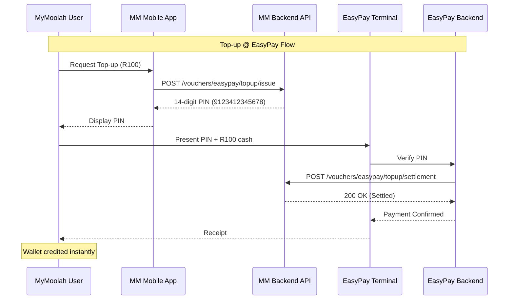
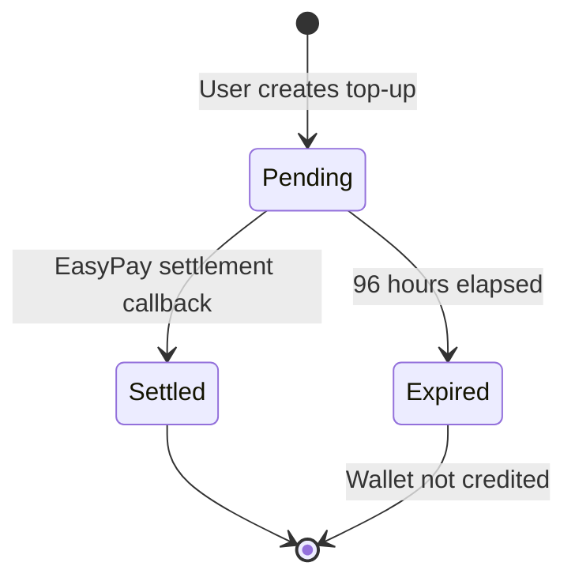
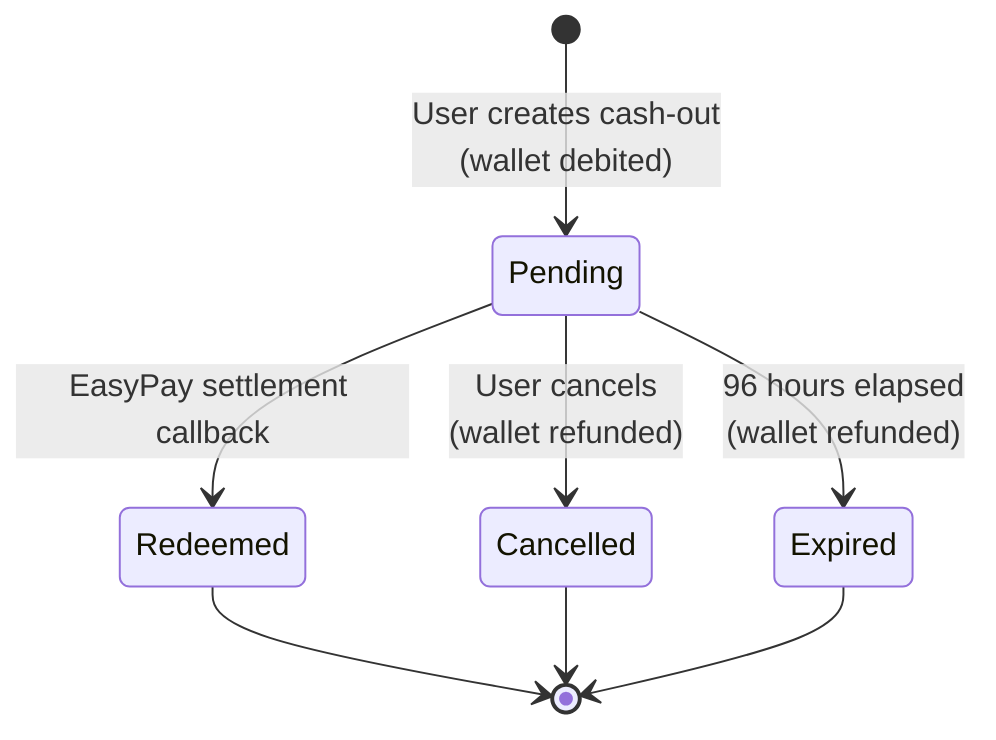
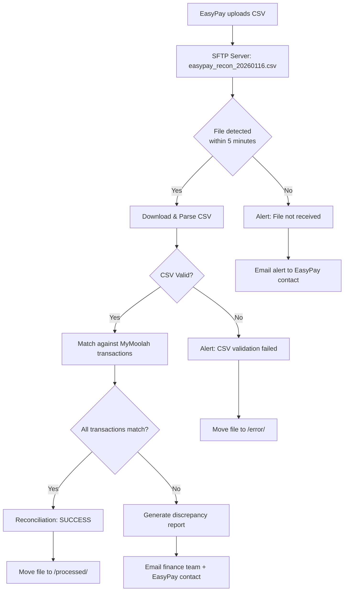
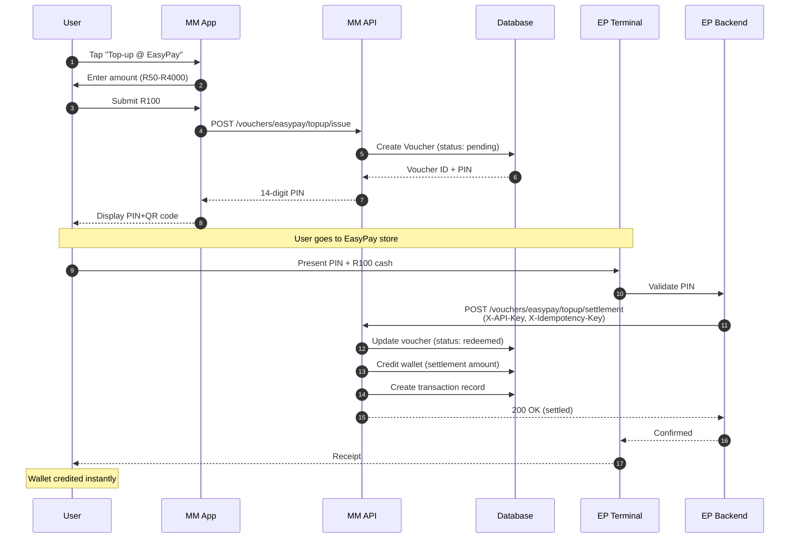
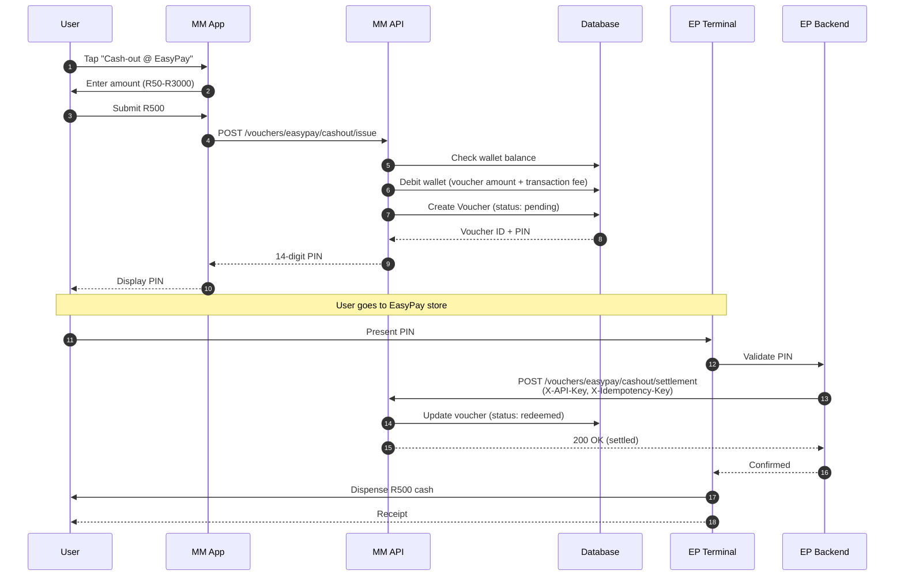

# EasyPay API Integration Guide

**Version**: 1.0.1  
**Last Updated**: January 16, 2026  
**API Provider**: MyMoolah Treasury Platform  
**Integration Partner**: EasyPay South Africa  
**Status**: ✅ Production Ready

---

## 📑 Table of Contents

1. [Executive Summary](#executive-summary)
2. [Quick Start Guide](#quick-start-guide)
3. [Authentication & Security](#authentication--security)
4. [API Endpoints](#api-endpoints)
5. [Data Models](#data-models)
6. [Error Handling](#error-handling)
7. [Idempotency](#idempotency)
8. [Testing Guide (UAT)](#testing-guide-uat)
9. [Production Deployment](#production-deployment)
10. [Reconciliation](#reconciliation)
11. [Support & SLAs](#support--slas)
12. [Appendices](#appendices)

---

## 1. Executive Summary

### 1.1 Overview

MyMoolah Treasury Platform provides two core EasyPay integration services:

1. **Top-up @ EasyPay**: Enables MyMoolah users to deposit cash into their wallets at any EasyPay merchant location
2. **Cash-out @ EasyPay**: Enables MyMoolah users to withdraw cash from their wallets at any EasyPay merchant location

### 1.2 Integration Architecture



### 1.3 Key Features

- **Banking-Grade Security**: API key authentication, IP whitelisting (infrastructure-level), TLS 1.3
- **Real-Time Settlement**: Instant wallet crediting upon payment confirmation
- **Comprehensive Audit Trail**: All transactions logged with full metadata
- **Idempotent Operations**: Safe retry mechanisms for network failures
- **Mojaloop Compliance**: Aligned with ISO 20022 and Mojaloop specifications
- **Structured Error Responses**: Banking-grade error format with codes, request IDs, and timestamps

---

## 2. Quick Start Guide

### 2.1 Prerequisites

- Valid EasyPay Merchant Agreement with MyMoolah
- UAT environment access credentials
- Technical contact designated for integration support
- Firewall rules configured for API access

### 2.2 Integration Checklist

- [ ] Obtain UAT API credentials (API key)
- [ ] Configure IP whitelist (if required)
- [ ] Implement authentication flow (X-API-Key header)
- [ ] Integrate settlement endpoints
- [ ] Implement idempotency (X-Idempotency-Key header)
- [ ] Test with UAT test users
- [ ] Complete reconciliation testing
- [ ] Request production credentials
- [ ] Deploy to production
- [ ] Monitor first 48 hours

### 2.3 5-Minute Quick Test

```bash
# 1. Test Top-up Settlement Endpoint
curl -X POST https://staging.mymoolah.africa/api/v1/vouchers/easypay/topup/settlement \
  -H "Content-Type: application/json" \
  -H "X-API-Key: your_uat_api_key_here" \
  -H "X-Idempotency-Key: test-topup-$(date +%s)" \
  -H "X-Request-ID: test-request-$(uuidgen)" \
  -d '{
    "easypay_code": "9123412345678",
    "settlement_amount": 100.00,
    "merchant_id": "EP_TEST_MERCHANT_001",
    "transaction_id": "EP_TXN_20260116_001",
    "terminal_id": "EP_TERMINAL_001",
    "timestamp": "2026-01-16T13:40:33+02:00"
  }'

# 2. Test Cash-out Settlement Endpoint
curl -X POST https://staging.mymoolah.africa/api/v1/vouchers/easypay/cashout/settlement \
  -H "Content-Type: application/json" \
  -H "X-API-Key: your_uat_api_key_here" \
  -H "X-Idempotency-Key: test-cashout-$(date +%s)" \
  -H "X-Request-ID: test-request-$(uuidgen)" \
  -d '{
    "easypay_code": "9123498765432",
    "settlement_amount": 500.00,
    "merchant_id": "EP_TEST_MERCHANT_001",
    "transaction_id": "EP_TXN_20260116_002",
    "terminal_id": "EP_TERMINAL_002",
    "timestamp": "2026-01-16T14:00:00+02:00"
  }'
```

---

## 3. Authentication & Security

### 3.1 Security Architecture

MyMoolah employs a **defense-in-depth** security model with multiple layers:

| Layer | Mechanism | Description |
|-------|-----------|-------------|
| **Transport** | TLS 1.3 | All API calls must use HTTPS with TLS 1.3+ |
| **Authentication** | API Key | X-API-Key header validation |
| **Network** | IP Whitelist | Source IP validation (infrastructure-level, optional) |
| **Application** | Request ID | X-Request-ID header for request tracking |
| **Idempotency** | Idempotency Keys | Prevent duplicate transactions |

### 3.2 API Key Authentication

**Required Header**: `X-API-Key`

**Format**: Secure random string (minimum 32 characters, recommended 64+)

**Example**:
```http
X-API-Key: a1b2c3d4e5f6g7h8i9j0k1l2m3n4o5p6q7r8s9t0u1v2w3x4y5z6
```

**Obtaining API Keys**:
- **UAT**: Provided by MyMoolah Integration Team after UAT registration
- **Production**: Provided separately via secure channel after UAT sign-off

**Security Best Practices**:
1. **Credential Storage**: Store API keys in secure vaults (e.g., HashiCorp Vault, AWS Secrets Manager, Google Secret Manager)
2. **Key Rotation**: Rotate API keys periodically (recommended: every 90 days)
3. **TLS Pinning**: Optionally pin MyMoolah's TLS certificate
4. **Request Logging**: Log all API interactions (mask API key in logs)
5. **Error Handling**: Never expose API keys in error messages

### 3.3 Required Headers

All API requests must include:

```http
X-API-Key: {API_KEY}
X-Idempotency-Key: {UNIQUE_REQUEST_ID}
Content-Type: application/json
X-Request-ID: {UUID} (optional but recommended)
```

**Header Descriptions**:

| Header | Required | Description | Example |
|--------|----------|-------------|---------|
| `X-API-Key` | Yes | API key for authentication | `a1b2c3d4e5f6...` |
| `X-Idempotency-Key` | Recommended | Unique key to prevent duplicate processing | `EP_MERCHANT_12345_EP_TXN_20260116_001_1642334433` |
| `Content-Type` | Yes | Must be `application/json` | `application/json` |
| `X-Request-ID` | Optional | UUID for request tracking | `550e8400-e29b-41d4-a716-446655440000` |

### 3.4 IP Whitelisting (Optional)

**Infrastructure-Level**: IP whitelisting is handled at the infrastructure level (Google Cloud Load Balancer). Contact MyMoolah Integration Team to register your IP addresses.

**Format**: IPv4 CIDR notation (e.g., `197.85.10.0/24`)

**UAT Allowed IPs**: Contact MyMoolah Integration Team to register  
**Production Allowed IPs**: Requires formal request with business justification

---

## 4. API Endpoints

### 4.1 Top-up @ EasyPay Settlement

#### Endpoint

```http
POST /api/v1/vouchers/easypay/topup/settlement
```

#### Description

Called by EasyPay when a user presents a Top-up PIN at a cashier and pays cash. This endpoint credits the user's MyMoolah wallet with the settlement amount.

#### Request

**Headers**:
```http
X-API-Key: {API_KEY}
X-Idempotency-Key: {UNIQUE_KEY}
Content-Type: application/json
X-Request-ID: {UUID} (optional)
```

**Body**:
```json
{
  "easypay_code": "9123412345678",
  "settlement_amount": 100.00,
  "merchant_id": "EP_MERCHANT_12345",
  "transaction_id": "EP_TXN_20260116_123456",
  "terminal_id": "EP_TERMINAL_001",
  "cashier_id": "CASHIER_789",
  "timestamp": "2026-01-16T13:40:33+02:00",
  "metadata": {
    "merchant_name": "Pick n Pay - Sandton City",
    "receipt_number": "RCP-001234"
  }
}
```

**Field Specifications**:

| Field | Type | Required | Description | Validation |
|-------|------|----------|-------------|------------|
| `easypay_code` | String | Yes | 14-digit EasyPay PIN | `/^9\d{13}$/` (starts with 9, 14 digits total) |
| `settlement_amount` | Number | Yes | Amount in ZAR (Rands) | `50.00-4000.00` (R50-R4000) |
| `merchant_id` | String | Yes | EasyPay merchant identifier | Max 50 chars |
| `transaction_id` | String | Yes | Unique EasyPay transaction ID | Max 100 chars, alphanumeric |
| `terminal_id` | String | Yes | Terminal identifier | Max 50 chars |
| `cashier_id` | String | No | Cashier identifier | Max 50 chars |
| `timestamp` | String | No | ISO 8601 timestamp with timezone | Must be within 5 minutes of server time |
| `metadata` | Object | No | Additional transaction data | Max 1KB |

#### Response

**Success (200 OK)**:
```json
{
  "success": true,
  "message": "EasyPay top-up settled successfully",
  "data": {
    "easypay_code": "9123412345678",
    "settlement_amount": 100.00,
    "status": "completed",
    "settlement_transaction_id": "STL-1642334433-abc123"
  }
}
```

**Response Field Descriptions**:

| Field | Type | Description |
|-------|------|-------------|
| `success` | Boolean | Always `true` for successful responses |
| `message` | String | Human-readable success message |
| `data.easypay_code` | String | The 14-digit EasyPay PIN that was settled |
| `data.settlement_amount` | Number | Amount paid at store and credited to wallet (Rands) |
| `data.status` | String | Settlement status (`completed`) |
| `data.settlement_transaction_id` | String | MyMoolah internal transaction ID |

**Error Responses**: See [Error Handling](#error-handling) section

---

### 4.2 Cash-out @ EasyPay Settlement

#### Endpoint

```http
POST /api/v1/vouchers/easypay/cashout/settlement
```

#### Description

Called by EasyPay when a user presents a Cash-out PIN at a cashier to withdraw cash. This endpoint marks the voucher as redeemed after cash has been dispensed. The user's wallet was already debited when the cash-out voucher was created.

#### Request

**Headers**:
```http
X-API-Key: {API_KEY}
X-Idempotency-Key: {UNIQUE_KEY}
Content-Type: application/json
X-Request-ID: {UUID} (optional)
```

**Body**:
```json
{
  "easypay_code": "9123498765432",
  "settlement_amount": 500.00,
  "merchant_id": "EP_MERCHANT_12345",
  "transaction_id": "EP_TXN_20260116_654321",
  "terminal_id": "EP_TERMINAL_002",
  "cashier_id": "CASHIER_456",
  "timestamp": "2026-01-16T14:00:00+02:00",
  "metadata": {
    "merchant_name": "Checkers - Rosebank",
    "receipt_number": "RCP-567890"
  }
}
```

**Field Specifications**:

| Field | Type | Required | Description | Validation |
|-------|------|----------|-------------|------------|
| `easypay_code` | String | Yes | 14-digit EasyPay PIN | `/^9\d{13}$/` |
| `settlement_amount` | Number | Yes | Amount dispensed in ZAR (Rands) | `50.00-3000.00` (R50-R3000), must match voucher amount |
| `merchant_id` | String | Yes | EasyPay merchant identifier | Max 50 chars |
| `transaction_id` | String | Yes | Unique EasyPay transaction ID | Max 100 chars |
| `terminal_id` | String | Yes | Terminal identifier | Max 50 chars |
| `cashier_id` | String | No | Cashier identifier | Max 50 chars |
| `timestamp` | String | No | ISO 8601 timestamp | Within 5 minutes of server time |
| `metadata` | Object | No | Additional data | Max 1KB |

#### Response

**Success (200 OK)**:
```json
{
  "success": true,
  "message": "EasyPay cash-out settled successfully",
  "data": {
    "easypay_code": "9123498765432",
    "voucher_amount": 500.00,
    "status": "completed",
    "settlement_transaction_id": "CASHOUT-STL-1642338000-xyz789"
  }
}
```

**Response Field Descriptions**:

| Field | Type | Description |
|-------|------|-------------|
| `success` | Boolean | Always `true` for successful responses |
| `message` | String | Human-readable success message |
| `data.easypay_code` | String | The 14-digit EasyPay PIN that was settled |
| `data.voucher_amount` | Number | Cash-out voucher amount (Rands) |
| `data.status` | String | Settlement status (`completed`) |
| `data.settlement_transaction_id` | String | MyMoolah internal transaction ID |

**Error Responses**: See [Error Handling](#error-handling) section

---

## 5. Data Models

### 5.1 Top-up Voucher Lifecycle



**States**:
- `pending_payment`: Voucher created, waiting for payment at store
- `redeemed`: Payment received, wallet credited
- `expired`: Voucher expired (96 hours), no wallet credit

### 5.2 Cash-out Voucher Lifecycle



**States**:
- `pending_payment`: Voucher created, wallet debited, waiting for cash-out at store
- `redeemed`: Cash dispensed, voucher consumed
- `cancelled`: User cancelled, wallet refunded
- `expired`: Voucher expired, wallet refunded

### 5.3 Settlement Request Schema

**Top-up Settlement Request**:
```json
{
  "easypay_code": "string (14 digits, starts with 9)",
  "settlement_amount": "number (50.00-4000.00)",
  "merchant_id": "string (max 50 chars)",
  "transaction_id": "string (max 100 chars, alphanumeric)",
  "terminal_id": "string (max 50 chars)",
  "cashier_id": "string (max 50 chars, optional)",
  "timestamp": "string (ISO 8601, optional)",
  "metadata": "object (max 1KB, optional)"
}
```

**Cash-out Settlement Request**:
```json
{
  "easypay_code": "string (14 digits, starts with 9)",
  "settlement_amount": "number (50.00-3000.00)",
  "merchant_id": "string (max 50 chars)",
  "transaction_id": "string (max 100 chars)",
  "terminal_id": "string (max 50 chars)",
  "cashier_id": "string (max 50 chars, optional)",
  "timestamp": "string (ISO 8601, optional)",
  "metadata": "object (max 1KB, optional)"
}
```

---

## 6. Error Handling

### 6.1 Error Response Format

All error responses follow this structured format:

```json
{
  "success": false,
  "error": {
    "code": "ERROR_CODE",
    "message": "Human-readable error message",
    "details": "Additional context or resolution steps",
    "request_id": "uuid-1234-5678-90ab",
    "timestamp": "2026-01-16T14:05:00.000Z"
  }
}
```

### 6.2 Error Codes

| Code | HTTP Status | Category | Description | Resolution |
|------|-------------|----------|-------------|------------|
| `INVALID_PIN` | 400 | Validation | PIN format incorrect | Check PIN is 14 digits starting with '9' |
| `PIN_NOT_FOUND` | 404 | Not Found | PIN doesn't exist or already settled | Verify PIN with user, check settlement status |
| `AMOUNT_MISMATCH` | 400 | Validation | Settlement amount doesn't match voucher | Verify expected amount with user |
| `PIN_EXPIRED` | 400 | Business Logic | PIN >96 hours old | User must create new top-up/cash-out request |
| `ALREADY_SETTLED` | 409 | Idempotency | Duplicate request (idempotency) | Return original response (idempotent) |
| `DUPLICATE_REQUEST` | 409 | Conflict | Idempotency key used with different request | Use unique idempotency key for each request |
| `MISSING_API_KEY` | 401 | Security | X-API-Key header missing | Include X-API-Key header |
| `INVALID_API_KEY` | 401 | Security | Invalid API key | Verify API key with MyMoolah |
| `MISSING_REQUIRED_FIELD` | 400 | Validation | Required field missing | Check request body for all required fields |
| `INVALID_AMOUNT` | 400 | Validation | Amount out of range | Top-up: R50-R4000, Cash-out: R50-R3000 |
| `INVALID_FORMAT` | 400 | Validation | Invalid request format | Verify JSON structure and field types |
| `WALLET_NOT_FOUND` | 404 | Not Found | User wallet not found | Contact MyMoolah support |
| `RATE_LIMIT_EXCEEDED` | 429 | Rate Limiting | Too many requests | Implement exponential backoff |
| `INTERNAL_ERROR` | 500 | Server | Unexpected server error | Contact MyMoolah support with request_id |

### 6.3 HTTP Status Codes

| Code | Category | Usage |
|------|----------|-------|
| 200 | Success | Request completed successfully |
| 400 | Client Error | Invalid request (validation failed) |
| 401 | Auth Error | Authentication failed (missing/invalid API key) |
| 404 | Client Error | Resource not found (PIN, voucher, wallet) |
| 409 | Conflict | Idempotency conflict or already processed |
| 429 | Rate Limit | Too many requests |
| 500 | Server Error | Internal server error |
| 502 | Server Error | Bad gateway |
| 503 | Server Error | Service unavailable |
| 504 | Server Error | Gateway timeout |

### 6.4 Retry Logic

**Recommended Retry Strategy**:

1. **Idempotent Requests**: Safe to retry with same idempotency key
2. **Exponential Backoff**: Base delay 1s, max 32s
3. **Retry Conditions**:
   - Network errors
   - HTTP 500, 502, 503, 504
   - Timeouts
4. **Do NOT Retry**:
   - HTTP 400, 401, 404 (fix request first)
   - HTTP 409 (already processed - use original response)

**Example Retry Implementation**:
```javascript
async function settlementWithRetry(payload, maxRetries = 3) {
  const idempotencyKey = generateIdempotencyKey(payload);
  
  for (let attempt = 1; attempt <= maxRetries; attempt++) {
    try {
      return await callSettlementAPI(payload, idempotencyKey);
    } catch (error) {
      if (isRetryable(error) && attempt < maxRetries) {
        const delay = Math.min(1000 * Math.pow(2, attempt - 1), 32000);
        await sleep(delay);
        continue;
      }
      throw error;
    }
  }
}

function isRetryable(error) {
  const retryableStatuses = [500, 502, 503, 504];
  return retryableStatuses.includes(error.status) || error.code === 'ECONNRESET';
}
```

---

## 7. Idempotency

### 7.1 Overview

Idempotency ensures that making the same request multiple times has the same effect as making it once. This is **critical for financial APIs** to prevent duplicate processing if network errors cause retries.

### 7.2 Implementation

**Header**: `X-Idempotency-Key`

**Format**: Unique string per request (recommended: `{merchant_id}_{terminal_id}_{transaction_id}_{timestamp}`)

**Example**:
```
X-Idempotency-Key: EP_MERCHANT_12345_EP_TERMINAL_001_EP_TXN_20260116_123456_1642334433
```

### 7.3 How It Works

1. **First Request**: Process normally, store response with idempotency key (24-hour TTL)
2. **Duplicate Request** (same key, same request body): Return cached response (HTTP 200)
3. **Different Request** (same key, different body): Return HTTP 409 CONFLICT

### 7.4 Best Practices

1. **Generate Unique Keys**: Use a combination of merchant_id, terminal_id, transaction_id, and timestamp
2. **Store Keys**: Keep idempotency keys for at least 24 hours (for retries)
3. **Handle 409 Responses**: If you receive HTTP 409, use a new idempotency key or verify the request body matches
4. **Never Reuse Keys**: Each unique request must have a unique idempotency key

### 7.5 Example

```javascript
// Generate idempotency key
const idempotencyKey = `${merchantId}_${terminalId}_${transactionId}_${Date.now()}`;

// First request
const response1 = await fetch(settlementUrl, {
  method: 'POST',
  headers: {
    'X-API-Key': apiKey,
    'X-Idempotency-Key': idempotencyKey,
    'Content-Type': 'application/json'
  },
  body: JSON.stringify(payload)
});

// If network error, retry with SAME idempotency key
// Second request (retry) - returns cached response from first request
const response2 = await fetch(settlementUrl, {
  method: 'POST',
  headers: {
    'X-API-Key': apiKey,
    'X-Idempotency-Key': idempotencyKey, // SAME key
    'Content-Type': 'application/json'
  },
  body: JSON.stringify(payload) // SAME payload
});
// response2 === response1 (cached)
```

---

## 8. Testing Guide (UAT)

### 8.1 UAT Environment Details

**Base URL**: `https://staging.mymoolah.africa`  
**API Base**: `https://staging.mymoolah.africa/api/v1`

**UAT Credentials**:
- **API Key**: Provided by MyMoolah Integration Team after UAT registration
- **Contact**: `integrations@mymoolah.africa`

> **Note**: UAT credentials are for testing only and will be deactivated in production.

### 8.2 Test Scenarios

#### Scenario 1: Successful Top-up

1. Create top-up voucher via MM app (User, R100)
2. Note 14-digit PIN generated
3. Call settlement API with correct details
4. Verify wallet credited with settlement amount

**Expected Response**: HTTP 200, `status: "completed"`, `settlement_amount: 100.00`

#### Scenario 2: Invalid PIN

1. Call settlement API with non-existent PIN `9999999999999`
2. Verify proper error response

**Expected Response**: HTTP 404, `error.code: "PIN_NOT_FOUND"`

#### Scenario 3: Amount Mismatch

1. Create R100 top-up
2. Call settlement with R150 amount
3. Verify rejection

**Expected Response**: HTTP 400, `error.code: "AMOUNT_MISMATCH"`

#### Scenario 4: Idempotency

1. Call settlement API
2. Immediately retry with same idempotency key
3. Verify identical response (no double credit)

**Expected Response**: HTTP 200 (both times), same settlement_transaction_id

#### Scenario 5: Expired PIN

1. Use pre-expired test PIN (expired 100 hours ago)
2. Attempt settlement
3. Verify rejection

**Expected Response**: HTTP 400, `error.code: "PIN_EXPIRED"`

#### Scenario 6: Missing API Key

1. Call settlement API without X-API-Key header
2. Verify authentication error

**Expected Response**: HTTP 401, `error.code: "MISSING_API_KEY"`

#### Scenario 7: Invalid API Key

1. Call settlement API with incorrect API key
2. Verify authentication error

**Expected Response**: HTTP 401, `error.code: "INVALID_API_KEY"`

### 8.3 UAT Sign-off Checklist

Before requesting production credentials:

- [ ] Successfully completed all 7 test scenarios
- [ ] Tested with multiple test users
- [ ] Verified idempotency handling
- [ ] Tested retry logic
- [ ] Verified error handling (all error codes)
- [ ] Completed reconciliation test
- [ ] Documented integration in internal wiki
- [ ] Security review passed
- [ ] Load testing completed (100 TPS)

---

## 9. Production Deployment

### 9.1 Production Credentials Request

To obtain production credentials, submit the following to `integrations@mymoolah.africa`:

1. **UAT Sign-off Report** (proof of successful testing)
2. **Production IP Addresses** (CIDR notation, if IP whitelisting required)
3. **Expected Transaction Volume** (daily/monthly)
4. **Business Contact** (name, email, phone)
5. **Technical Contact** (name, email, phone, 24/7 on-call number)
6. **Go-Live Date** (proposed)

**SLA**: 5 business days for credential provisioning

### 9.2 Production Environment

**Base URL**: `https://api.mymoolah.africa` (when available)  
**API Base**: `https://api.mymoolah.africa/api/v1`

**Credentials**: Delivered via secure channel after approval

**Note**: Production environment is planned but not yet deployed. Staging environment should be used for production readiness testing.

### 9.3 Go-Live Checklist

- [ ] Production credentials received and stored securely
- [ ] IP whitelist configured (if required)
- [ ] Production code deployed
- [ ] Monitoring & alerting configured
- [ ] Incident response plan documented
- [ ] MyMoolah support contacts saved
- [ ] First transaction test completed
- [ ] Reconciliation process automated
- [ ] Disaster recovery plan tested

### 9.4 Production Best Practices

1. **Monitoring**: Set up real-time monitoring for:
   - API response times (target: <500ms p95)
   - Error rates (target: <0.1%)
   - Settlement success rate (target: >99.9%)

2. **Alerting**: Configure alerts for:
   - Authentication failures
   - Consecutive API errors
   - Unusual transaction patterns

3. **Logging**: Log all API interactions with:
   - Request/Response payloads (mask API key)
   - Timestamps
   - Response times
   - Error stack traces

4. **Capacity Planning**: MyMoolah API can handle:
   - 1,000 requests per second
   - 10,000 concurrent connections
   - 99.95% uptime SLA

---

## 10. Reconciliation

### 10.1 SFTP-Based Reconciliation (Primary Method)

MyMoolah operates a **secure SFTP server** for automated daily reconciliation file exchange. This is the **recommended** reconciliation method for production environments.

#### 10.1.1 SFTP Connection Details

**Production SFTP Server**:
```
Host: 34.35.137.166
Port: 22
Username: easypay
Authentication: SSH public key only (no password authentication)
Home Directory: /home/easypay (mapped to gs://mymoolah-sftp-inbound/easypay/)
```

**Security Requirements**:
- SSH key-based authentication (RSA 4096-bit or ED25519 recommended)
- Source IP whitelisting (provide your CIDR ranges)
- TLS 1.3 for file transfer encryption

#### 10.1.2 SFTP Setup Process

**Step 1: Generate SSH Key Pair** (if not already available)

```bash
# Generate ED25519 key (recommended)
ssh-keygen -t ed25519 -C "easypay-reconciliation@easypay.co.za"

# Or generate RSA 4096-bit key
ssh-keygen -t rsa -b 4096 -C "easypay-reconciliation@easypay.co.za"
```

**Step 2: Provide MyMoolah with the Following**

Email to: `integrations@mymoolah.africa`

Subject: `EasyPay SFTP Reconciliation Setup - [Your Company Name]`

Body:
```
1. SSH Public Key: [Paste contents of id_ed25519.pub or id_rsa.pub]
2. Source IP/CIDR Ranges: [e.g., 197.85.10.0/24, 41.203.45.100/32]
3. Technical Contact: [Name, Email, Phone]
4. Expected Go-Live Date: [YYYY-MM-DD]
```

**Step 3: Test Connection** (after MyMoolah confirms setup)

```bash
sftp -P 22 easypay@34.35.137.166

# You should see:
# Connected to 34.35.137.166
# sftp>
```

#### 10.1.3 File Upload Requirements

**File Naming Convention**:
```
easypay_recon_YYYYMMDD.csv
```

**Examples**:
- `easypay_recon_20260116.csv` (daily file for January 16, 2026)
- `easypay_recon_20260117.csv` (daily file for January 17, 2026)

**Upload Schedule**:
- **Frequency**: Daily
- **Cutoff Time**: 23:59:59 SAST
- **Upload Window**: 00:00 - 06:00 SAST (next day)
- **Example**: Transactions from Jan 16 (00:00 - 23:59) should be uploaded as `easypay_recon_20260116.csv` between Jan 17 00:00 - 06:00

**Upload Command**:
```bash
# Upload reconciliation file
sftp easypay@34.35.137.166 << EOF
cd /home/easypay
put easypay_recon_20260116.csv
bye
EOF
```

#### 10.1.4 CSV File Format Specification

**File Encoding**: UTF-8  
**Delimiter**: Comma (`,`)  
**Line Ending**: LF (`\n`) or CRLF (`\r\n`)  
**Quote Character**: Double quote (`"`) for fields containing commas  
**Header Row**: Required (first line)

**CSV Schema**:

| Column | Type | Required | Description | Format/Rules |
|--------|------|----------|-------------|--------------|
| `transaction_id` | String | Yes | EasyPay transaction ID | Max 100 chars, alphanumeric + `-_` |
| `easypay_code` | String | Yes | 14-digit PIN | `/^9\d{13}$/` |
| `transaction_type` | String | Yes | Transaction type | `topup` or `cashout` |
| `merchant_id` | String | Yes | Merchant identifier | Max 50 chars |
| `terminal_id` | String | Yes | Terminal identifier | Max 50 chars |
| `cashier_id` | String | No | Cashier identifier | Max 50 chars, empty if N/A |
| `transaction_timestamp` | String | Yes | Transaction date/time | ISO 8601: `YYYY-MM-DDTHH:MM:SS+02:00` |
| `gross_amount` | Decimal | Yes | Amount in ZAR | Format: `0.00`, 2 decimal places |
| `settlement_status` | String | Yes | EasyPay settlement status | `settled`, `pending`, `failed` |
| `merchant_name` | String | No | Merchant location name | Max 100 chars |
| `receipt_number` | String | No | Receipt number | Max 50 chars |

**Example CSV**:

```csv
transaction_id,easypay_code,transaction_type,merchant_id,terminal_id,cashier_id,transaction_timestamp,gross_amount,settlement_status,merchant_name,receipt_number
EP_TXN_20260116_001,9123412345678,topup,EP_MERCHANT_12345,EP_TERMINAL_001,CASHIER_789,2026-01-16T13:40:33+02:00,100.00,settled,Pick n Pay - Sandton City,RCP-001234
EP_TXN_20260116_002,9123498765432,cashout,EP_MERCHANT_12345,EP_TERMINAL_002,CASHIER_456,2026-01-16T14:00:00+02:00,500.00,settled,Checkers - Rosebank,RCP-567890
EP_TXN_20260116_003,9123400000003,topup,EP_MERCHANT_67890,EP_TERMINAL_005,,2026-01-16T15:30:00+02:00,250.00,settled,Woolworths - Mall of Africa,RCP-123123
```

**CSV Validation Rules**:
- File size: Max 100MB (contact support if larger)
- Row limit: Max 100,000 transactions per file
- All required fields must be non-empty
- `gross_amount` must match the amount in MyMoolah's records (±R0.01 tolerance)
- `transaction_timestamp` must be within the date range of the filename

#### 10.1.5 Automated Reconciliation Process

MyMoolah's **automated reconciliation service** monitors the SFTP server and processes files as follows:



**Processing Timeline**:
1. **File Upload**: 00:00 - 06:00 SAST
2. **Auto-Detection**: Within 5 minutes of upload
3. **Validation**: ~1 minute
4. **Reconciliation**: ~5 minutes (for 10,000 transactions)
5. **Notification**: Immediate (success or failure)

**Reconciliation Results**:

| Result | Action | Notification |
|--------|--------|-------------|
| **100% Match** | File moved to `/processed/` | Email: "Reconciliation successful" |
| **Discrepancies Found** | File moved to `/discrepancies/` | Email with discrepancy report |
| **CSV Invalid** | File moved to `/error/` | Email with validation errors |
| **File Missing** | No file detected by 07:00 | Email: "Reconciliation file not received" |

**Discrepancy Handling**:

If discrepancies are found, MyMoolah generates a report with details. Contact `finance@mymoolah.africa` for resolution.

#### 10.1.6 SFTP Best Practices

1. **Automate Uploads**: Use cron jobs or scheduled tasks
2. **Verify File Integrity**: Calculate MD5 checksum before upload
3. **Log All Transfers**: Maintain audit log of uploaded files
4. **Monitor Notifications**: Set up email alerts for reconciliation results
5. **Backup Files**: Keep local copies for 90 days minimum

**Example Automated Upload Script** (Linux/macOS):

```bash
#!/bin/bash
# Daily EasyPay Reconciliation Upload
# Schedule with cron: 0 2 * * * /path/to/upload_recon.sh

DATE=$(date -d "yesterday" +%Y%m%d)
FILE="easypay_recon_${DATE}.csv"
LOCAL_PATH="/opt/easypay/recon/${FILE}"
SFTP_HOST="34.35.137.166"
SFTP_USER="easypay"

# Generate reconciliation file (your internal process)
/opt/easypay/scripts/generate_recon.sh $DATE

# Verify file exists and is not empty
if [ ! -s "$LOCAL_PATH" ]; then
    echo "ERROR: Reconciliation file missing or empty" | mail -s "EasyPay Recon Upload Failed" ops@easypay.co.za
    exit 1
fi

# Upload to MyMoolah SFTP
sftp ${SFTP_USER}@${SFTP_HOST} << EOF
cd /home/easypay
put ${LOCAL_PATH}
bye
EOF

if [ $? -eq 0 ]; then
    echo "SUCCESS: Uploaded ${FILE}" | mail -s "EasyPay Recon Upload Successful" ops@easypay.co.za
else
    echo "ERROR: SFTP upload failed" | mail -s "EasyPay Recon Upload Failed" ops@easypay.co.za
    exit 1
fi
```

### 10.2 Alternative: REST API Reconciliation

For partners who cannot use SFTP, MyMoolah provides a REST API endpoint for downloading reconciliation data.

**Endpoint**:
```
GET /api/v1/reconciliation/easypay/daily/{date}
```

**Parameters**:
- `date`: YYYY-MM-DD format (e.g., `2026-01-16`)

**Response**: Same CSV format as SFTP (see Section 10.1.4)

**Authentication**: Requires X-API-Key header

**Example**:
```bash
curl -X GET https://staging.mymoolah.africa/api/v1/reconciliation/easypay/daily/2026-01-16 \
  -H "X-API-Key: {API_KEY}" \
  --output easypay_recon_20260116.csv
```

**Note**: SFTP method is **strongly preferred** for production as it provides automated reconciliation processing. REST API requires manual processing on EasyPay's side.

---

## 11. Support & SLAs

### 11.1 Support Channels

| Channel | Availability | Response Time | Use Case |
|---------|-------------|---------------|----------|
| **Email** | 24/7 | 4 hours | Non-urgent queries |
| **Phone** | 08:00-17:00 SAST | Immediate | Production issues |
| **Emergency Hotline** | 24/7 | 15 minutes | Critical outages |

**Contact Details**:
- Email: `support@mymoolah.africa`
- Integration Support: `integrations@mymoolah.africa`
- Phone: `+27 21 140 7030`
- Emergency: `+27 82 557 1055`

### 11.2 Service Level Agreements

| Metric | Target | Measurement |
|--------|--------|-------------|
| API Availability | 99.95% | Monthly uptime |
| API Response Time (p95) | <500ms | 95th percentile |
| Settlement Processing Time | <5 seconds | From API call to wallet credit |
| Support Response (Critical) | <15 minutes | Phone/emergency hotline |
| Support Response (Non-Critical) | <4 hours | Email |

### 11.3 Incident Response

In case of production issues:

1. **Immediate**: Call emergency hotline
2. **Provide**: Request ID from error response (`X-Request-ID` header or `error.request_id` in response)
3. **Escalation**: Automatic escalation after 30 minutes
4. **Status Updates**: Posted to status.mymoolah.africa (when available)

---

## 12. Appendices

### Appendix A: Sequence Diagrams

#### Top-up Flow (Detailed)



#### Cash-out Flow (Detailed)



### Appendix B: Error Code Reference

| Code | HTTP | Category | Description | Action |
|------|------|----------|-------------|--------|
| `INVALID_PIN` | 400 | Validation | PIN format incorrect | Fix PIN format |
| `PIN_NOT_FOUND` | 404 | Not Found | PIN doesn't exist | Verify with user |
| `AMOUNT_MISMATCH` | 400 | Validation | Amount ≠ expected | Verify amount |
| `PIN_EXPIRED` | 400 | Business Logic | PIN >96 hours old | User creates new PIN |
| `ALREADY_SETTLED` | 409 | Idempotency | Duplicate request | Use original response |
| `DUPLICATE_REQUEST` | 409 | Conflict | Key used with different request | Use unique key |
| `MISSING_API_KEY` | 401 | Security | X-API-Key missing | Include header |
| `INVALID_API_KEY` | 401 | Security | Invalid API key | Verify key |
| `MISSING_REQUIRED_FIELD` | 400 | Validation | Required field missing | Check request body |
| `INVALID_AMOUNT` | 400 | Validation | Amount out of range | Check limits |
| `INVALID_FORMAT` | 400 | Validation | Invalid format | Verify JSON structure |
| `WALLET_NOT_FOUND` | 404 | Not Found | User wallet not found | Contact support |
| `RATE_LIMIT_EXCEEDED` | 429 | Rate Limiting | Too many requests | Backoff and retry |
| `INTERNAL_ERROR` | 500 | Server | Unexpected error | Contact support |

### Appendix C: Glossary

| Term | Definition |
|------|------------|
| **EasyPay Code** | 14-digit PIN starting with '9' using Luhn algorithm |
| **Settlement** | Process of confirming payment and updating wallet |
| **Settlement Amount** | Amount paid/withdrawn by user and processed |
| **Idempotency Key** | Unique identifier preventing duplicate processing |
| **Voucher Lifecycle** | States: pending → settled/redeemed/expired/cancelled |
| **Request ID** | UUID for tracking requests in logs and support |

### Appendix D: Change Log

| Version | Date | Changes |
|---------|------|---------|
| 1.0.1 | 2026-01-16 | Removed fee and margin references (commercial agreement pending) |
| 1.0.0 | 2026-01-16 | Initial release - Banking-grade API documentation |

---

## 📞 Need Help?

**Integration Support Team**  
Email: support@mymoolah.africa  
Phone: +27 21 140 7030  
Emergency: +27 82 557 1055

**General Support**  
Email: support@mymoolah.africa

**Documentation Feedback**  
If you find any issues or have suggestions for improving this documentation, please email: andre@mymoolah.africa

---

**MyMoolah Treasury Platform**  
*Powering Africa's Financial Inclusion*

© 2026 MyMoolah (Pty) Ltd. All rights reserved.
